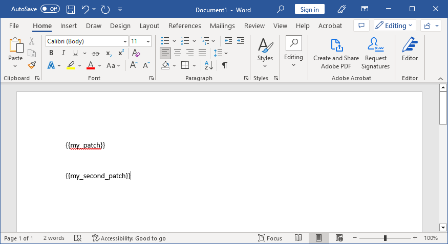

The patcher allows you to modify existing documents, and add new content to them.

> The Patcher requires an understanding of [Paragraphs](../usage/paragraph).

---

## Usage

```ts
import { patchDocument } from "@ddloop/docx";

patchDocument(documentBuffer, {
    patches: {
        // Patches here
    },
});
```

## Patches

The patcher takes in a `patches` object, which is a map of `string` to `Patch`:

```ts
interface Patch {
    type: PatchType;
    children: FileChild[] | ParagraphChild[];
}
```

| Property | Type                              | Notes    | Possible Values                                                                                                                      |
| -------- | --------------------------------- | -------- | ------------------------------------------------------------------------------------------------------------------------------------ |
| type     | `PatchType`                       | Required | `DOCUMENT`, `PARAGRAPH`                                                                                                              |
| children | `FileChild[] or ParagraphChild[]` | Required | The contents to replace with. A `FileChild` is a `Paragraph` or `Table`, whereas a `ParagraphChild` is typical `Paragraph` children. |


## Options

### keepOriginalStyles

The patcher also takes in a `keepOriginalStyles` boolean, which will preserve the styles of the patched text when set to true.

### placeholderDelimiters

By default, the patcher uses mustache-style notation with `{{` and `}}` delimiters. You can customize these delimiters:

```ts
patchDocument(documentBuffer, {
    patches: {
        my_patch: {
            type: PatchType.PARAGRAPH,
            children: [new TextRun("Hello World")],
        },
    },
    placeholderDelimiters: {
        start: "<<",
        end: ">>"
    }
});
```

With custom delimiters, your Word document would use `<<my_patch>>` instead of `{{my_patch}}`.

### How to patch existing document

1. Open your existing word document in your favorite Word Processor
2. Write tags in the document where you want to patch in a mustache style notation. For example, `{{my_patch}}` and `{{my_second_patch}}`.
3. Run the patcher with the patches as a key value pair.

## Example

### Word Document



### Patcher

> Notice how there is no handlebar notation in the key.

The patch can be as simple as a string, or as complex as a table. Images, hyperlinks, and other complex elements within the `docx` library are also supported.

```ts
patchDocument(documentBuffer, {
    patches: {
        my_patch: {
            type: PatchType.PARAGRAPH,
            children: [new TextRun("Sir. "), new TextRun("John Doe"), new TextRun("(The Conqueror)")],
        },
        my_second_patch: {
            type: PatchType.DOCUMENT,
            children: [
                new Paragraph("Lorem ipsum paragraph"),
                new Paragraph("Another paragraph"),
                new Paragraph({
                    children: [
                        new TextRun("This is a "),
                        new ExternalHyperlink({
                            children: [
                                new TextRun({
                                    text: "Google Link",
                                }),
                            ],
                            link: "https://www.google.co.uk",
                        }),
                        new ImageRun({ type: 'png', data: imageBuffer, transformation: { width: 100, height: 100 } }),
                    ],
                }),
            ],
        },
    },
});
```

---

## Error Handling

### TokenNotFoundError

When a placeholder token is not found in the document, the patcher will throw a `TokenNotFoundError`. This error includes the specific token that couldn't be found, making it easier to debug patching issues.

```ts
import { patchDocument, TokenNotFoundError, PatchType, TextRun } from "@ddloop/docx";

try {
    await patchDocument({
        data: documentBuffer,
        outputType: "blob",
        patches: {
            my_patch: {
                type: PatchType.PARAGRAPH,
                children: [new TextRun("Hello World")],
            },
        },
    });
} catch (error) {
    if (error instanceof TokenNotFoundError) {
        console.error(`Token "${error.token}" was not found in the document`);
        // Handle token-specific error
    } else {
        throw error;
    }
}
```

---

## Detecting Patches

### patchDetector

Before patching a document, you may want to know which placeholders are actually present in the template. The `patchDetector` function scans a document and returns an array of all placeholder tokens it finds. This is especially useful when working with multiple templates that use different placeholders, or to avoid expensive operations for placeholders that don't exist in the current template.

```ts
import { patchDetector, patchDocument, PatchType, ImageRun } from "@ddloop/docx";

const placeholders = await patchDetector({ data: documentBuffer });
// Returns: ['name', 'address', 'company_logo']

// Only prepare patches that are actually needed
const patches = {};
if (placeholders.includes('company_logo')) {
    patches.company_logo = {
        type: PatchType.PARAGRAPH,
        children: [
            new ImageRun({
                type: 'png',
                data: logoImageBuffer,
                transformation: { width: 200, height: 100 }
            })
        ]
    };
}

await patchDocument({
    data: documentBuffer,
    outputType: "blob",
    patches,
});
```

#### Custom Delimiters

If you're using custom placeholder delimiters, pass them to `patchDetector` to match:

```ts
const placeholders = await patchDetector({
    data: documentBuffer,
    placeholderDelimiters: {
        start: "<<",
        end: ">>"
    }
});
// Finds placeholders like <<name>>, <<address>>

await patchDocument({
    data: documentBuffer,
    outputType: "blob",
    patches,
    placeholderDelimiters: {
        start: "<<",
        end: ">>"
    }
});
```

---

## Demo

_Source: https://github.com/dolanmiu/docx/blob/master/demo/85-template-document.ts_

[Example](https://raw.githubusercontent.com/dolanmiu/docx/master/demo/85-template-document.ts ":include :type=code typescript")
