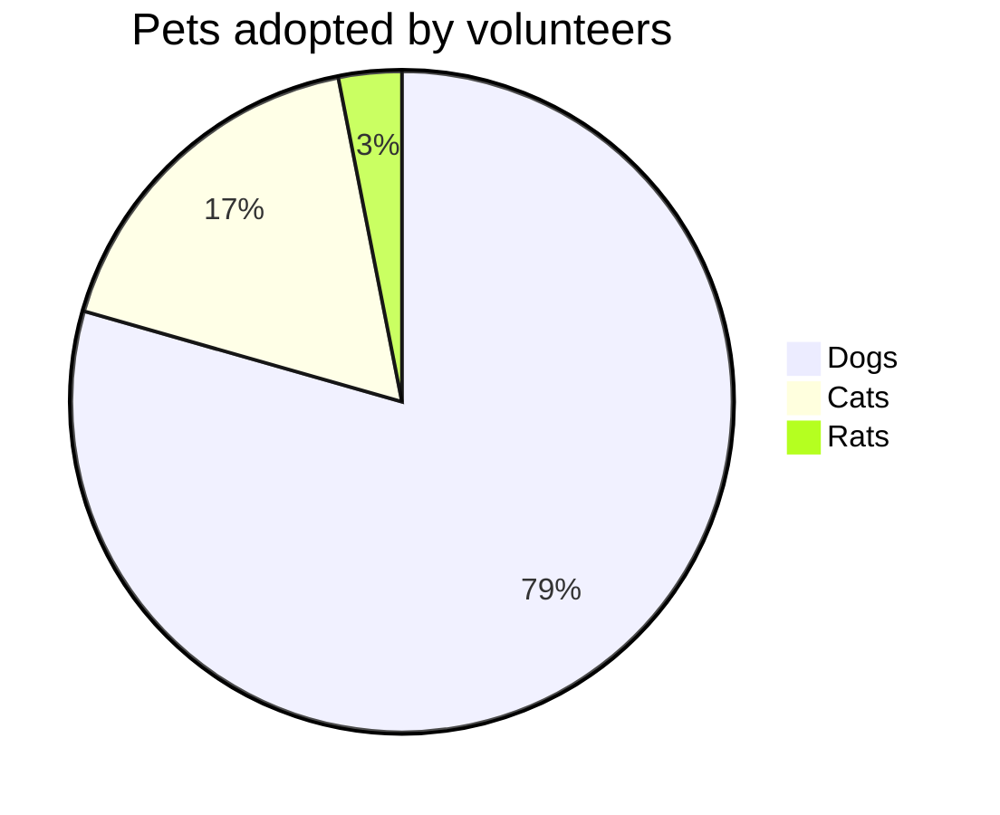
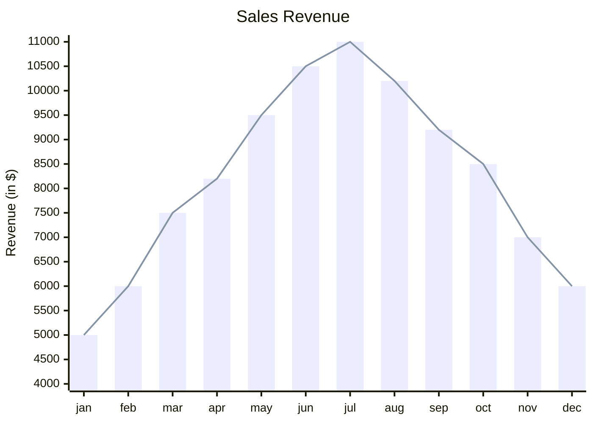

# Charts from Mermaid

<!-- cspell:ignore xychart Gantt -->

[Mermaid](https://mermaid.js.org) draws charts from text, such as a pie chart or an XY chart of bars and lines. This page shows the `ChartRun` for each, so a chart written in Mermaid can be a native Word chart, which Word draws and **Edit Data** opens.

`docx` doesn't read Mermaid's text. Give its data to a `ChartRun`, as below. [Charts](usage/charts.md) shows how to import `ChartRun` and add a chart to a document.

## Pie Charts

This Mermaid pie chart:



is this chart:

```ts
new ChartRun({
    type: "pie",
    title: "Pets adopted by volunteers",
    categories: ["Dogs", "Cats", "Rats"],
    series: [{ name: "Pets", values: [386, 85, 15] }],
    dataLabels: { percentage: true },
    legend: { position: "right" },
});
```

| Mermaid                               | `ChartRun`                                                                                                                                                                  |
| ------------------------------------- | --------------------------------------------------------------------------------------------------------------------------------------------------------------------------- |
| `pie`                                 | `type: "pie"`                                                                                                                                                               |
| `title Pets adopted by volunteers`    | `title: "Pets adopted by volunteers"`                                                                                                                                       |
| `"Dogs" : 386`, a line for each slice | `"Dogs"` in `categories`, and `386` in the series' `values`, in the same order                                                                                              |
| The slices' percentages               | `dataLabels: { percentage: true }`                                                                                                                                          |
| `showData`                            | `dataLabels: { percentage: true, value: true }`, which puts the values on the slices instead                                                                                |
| The legend on the right               | `legend: { position: "right" }`. Word puts it below by default                                                                                                              |
| `donutHole: 0.4`                      | `type: "doughnut"`, with `holeSize: 40`, from 10 to 90                                                                                                                      |
| `legendPosition: "top"`               | `legend: { position: "top" }`                                                                                                                                               |
| `highlightSlice: "Dogs"`              | No equivalent: Mermaid draws the slice a little larger, and the others fainter. The series' `explosion` can single it out another way, by pulling it out: `explosion: [20]` |

A Word chart's series has a name, which Mermaid's pie has none of, so give it one. See [Pie and Doughnut Charts](usage/chart-pie-and-doughnut.md).

### From Mermaid's Text

When the Mermaid text is what you have, a few lines of your own code can turn a pie chart into a `ChartRun`:

```ts
import { ChartRun } from "docx/charts";

// A Mermaid pie chart as a ChartRun: its title, and a slice for each "label" : value line
const pieFromMermaid = (mermaid: string): ChartRun => {
    const lines = mermaid.split("\n").map((line) => line.trim());
    const title = lines.map((line) => /^(?:pie\s+(?:showData\s+)?)?title\s+(.+)$/.exec(line)?.[1]).find((found) => found !== undefined);
    const showData = lines.some((line) => /^pie\s+showData\b/.test(line));
    const slices = lines.flatMap((line) => {
        const match = /^"(.*)"\s*:\s*([\d.]+)$/.exec(line);
        return match ? [{ label: match[1], value: Number(match[2]) }] : [];
    });
    return new ChartRun({
        type: "pie",
        title,
        categories: slices.map(({ label }) => label),
        series: [{ name: title ?? "Share", values: slices.map(({ value }) => value) }],
        dataLabels: { percentage: true, value: showData },
        legend: { position: "right" },
    });
};
```

It reads Mermaid's pie syntax only. It leaves out the Mermaid config above the chart, such as its colours and `donutHole`.

## XY Charts

Mermaid's XY chart (`xychart`, or `xychart-beta` in older versions of Mermaid) draws bars and lines against categories. This one:



is this column chart, with its line drawn as a line, as a [combo chart](usage/chart-combo.md):

```ts
const revenue = [5000, 6000, 7500, 8200, 9500, 10500, 11000, 10200, 9200, 8500, 7000, 6000];

new ChartRun({
    type: "column",
    title: "Sales Revenue",
    categories: ["jan", "feb", "mar", "apr", "may", "jun", "jul", "aug", "sep", "oct", "nov", "dec"],
    series: [
        { name: "Revenue", values: revenue },
        { name: "Trend", values: revenue, type: "line" },
    ],
    valueAxis: { title: "Revenue (in $)", minimum: 4000, maximum: 11000 },
    legend: false,
});
```

| Mermaid                                    | `ChartRun`                                                                                                   |
| ------------------------------------------ | ------------------------------------------------------------------------------------------------------------ |
| `xychart`                                  | `type: "column"`, or `type: "line"` when every series is a line                                              |
| `xychart horizontal`                       | `type: "bar"`. A bar chart's series are all bars, so a `line` can't be drawn on it                           |
| `title "Sales Revenue"`                    | `title: "Sales Revenue"`                                                                                     |
| `x-axis [jan, feb, mar]`                   | `categories: ["jan", "feb", "mar"]`                                                                          |
| `x-axis "Month" [jan, feb, mar]`           | The categories, and `categoryAxis: { title: "Month" }`                                                       |
| `x-axis 1 --> 5`                           | Numbers as the categories, from 1 to 5, spread evenly, one for each value: `[1, 2, 3, 4, 5]` for five values |
| `y-axis "Revenue (in $)" 4000 --> 11000`   | `valueAxis: { title: "Revenue (in $)", minimum: 4000, maximum: 11000 }`                                      |
| `y-axis "Revenue (in $)"`                  | `valueAxis: { title: "Revenue (in $)" }`, and Word picks the range                                           |
| `bar [5000, 6000]`                         | A series: `{ name, values: [5000, 6000] }`                                                                   |
| `line [5000, 6000]`                        | A series drawn as a line: `{ name, values: [5000, 6000], type: "line" }`                                     |
| `bar "North" [5000, 6000]`, a named series | `{ name: "North", values: [5000, 6000] }`, which the legend shows                                            |
| No named series                            | `legend: false`                                                                                              |
| Named and unnamed series                   | Give every series a name, and hide the unnamed ones' from the legend with `legend: { hiddenEntries: [...] }` |

A Word chart's series each have a name, for the legend and for **Edit Data**, so give Mermaid's unnamed ones names too. See [Column and Bar Charts](usage/chart-column-and-bar.md) and [Line and Area Charts](usage/chart-line-and-area.md).

## Other Mermaid Diagrams

Mermaid's radar chart is a [radar chart](usage/chart-radar.md) here too. Its quadrant, Sankey and Gantt charts have no Word chart to match. Its flowcharts and other diagrams can be drawn as shapes, which lay themselves out as flows and trees: see [Shapes](usage/shapes.md).
